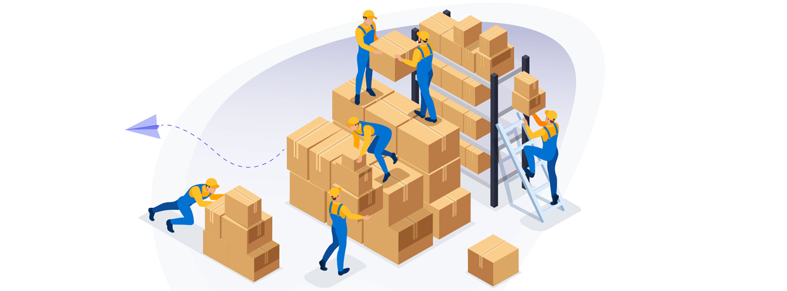

    

# **DEJA-IMp**

## **Description**

Warehouse management software for enterprise transition from traditional ledger based inventory systems to team based digital inventory systems with live updated shared data.

## Table of Contents

- [Installation](#installation)
- [Usage](#usage)
- [License](#license)
- [Questions](#questions)

    

## **Installation**

If retrieving application code from [github](https://github.com/edellenator/Deja-imp) you must have the following

- Node.js installed @ ver 17.9.0
- A local MongoDB server to run a local test Database
- All npm dependencies installed (from the app root directory in your terminal "npm install")

*note: the server runs locally on port 3001 for the apollo servers and 3000 for the react front end when testing locally*

Otherwise it is deployed at [Heroku](https://deja-imp.herokuapp.com)

## **Usage**

    

## Credits

- Debbie Neflas
- Joel Abankwah
- Akeva Melchor
- Erik Dell

## License

>Copyright <2022> DEJA
>
>Permission is hereby granted, free of charge, to any person obtaining a copy of this software and associated documentation files (the "Software"), to deal in the Software without restriction, including without limitation the rights to use, copy, modify, merge, publish, distribute, sublicense, and/or sell copies of the Software, and to permit persons to whom the Software is furnished to do so, subject to the following conditions:
>
>The above copyright notice and this permission notice shall be included in all copies or substantial portions of the Software.
>
>THE SOFTWARE IS PROVIDED "AS IS", WITHOUT WARRANTY OF ANY KIND, EXPRESS OR IMPLIED, INCLUDING BUT NOT LIMITED TO THE WARRANTIES OF MERCHANTABILITY, FITNESS FOR A PARTICULAR PURPOSE AND NONINFRINGEMENT. IN NO EVENT SHALL THE AUTHORS OR COPYRIGHT HOLDERS BE LIABLE FOR ANY CLAIM, DAMAGES OR OTHER LIABILITY, WHETHER IN AN ACTION OF CONTRACT, TORT OR OTHERWISE, ARISING FROM, OUT OF OR IN CONNECTION WITH THE SOFTWARE OR THE USE OR OTHER DEALINGS IN THE SOFTWARE.

## Questions

Please direct all questions to Erik

[github](https://github.com/edellenator)

Or you can email him at:

edellenator@gmail.com

